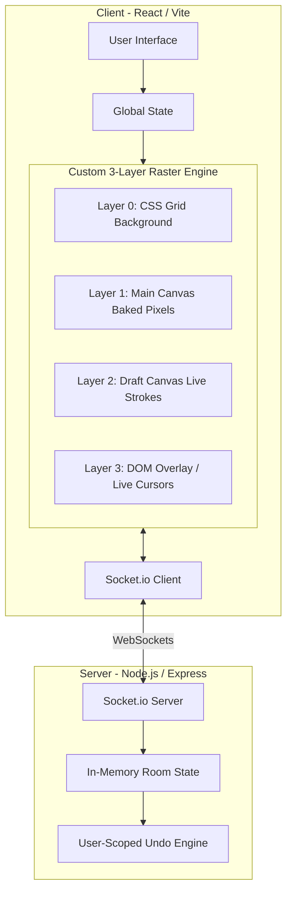

# Drawwww

A modern, ultra-low latency collaborative drawing application built with React, Socket.io, and a custom **High-Performance HTML5 Raster Engine**.

🌍 **Live Demo:** [https://aettheriia.vercel.app/](https://aettheriia.vercel.app/)

## 🏗️ Architecture Diagram



## 🚀 Features

- **Real-time Collaboration**: Instantly see what others are drawing via optimized command-log syncing.
- **Advanced 3-Layer Raster Engine**: 
    - Replaced traditional heavy vector libraries with a custom raw Canvas 2D engine for iPad-like drawing performance.
    - Features `perfect-freehand` for silky smooth, pressure-simulated strokes.
- **Advanced Tools**:
    - **Pencil Variants**: Sketch, Marker, Spray, and **Highlighter** (using `multiply` compositing).
    - **Flood Fill**: Intelligent canvas region filling.
    - **True Pixel Eraser**: A destructive `destination-out` eraser that perfectly cuts through raster pixels in real-time.
    - **Fluid Shapes**: Rectangle, Circle, Triangle, Diamond, Star, Hexagon, Arrow (baked instantly to raster).
- **Background Images**: Upload coloring pages or image outlines to draw over. Automatically enforces image file type filtering (`.png`, `.jpg`, `.webp`, etc.).
- **Live Multiplayer Cursors**: See where everyone is hovering in real-time, complete with their nicknames.
- **User-Scoped Undo/Redo**: Server-managed, fully robust undo/redo system. Undoing your action *only* removes your strokes, without interfering with the drawings of other collaborators.
- **Image Export**: Download your high-res canvas directly to a PNG with a single click.
- **Hybrid Object Overlay (Text)**: 
    - Instagram-style floating text annotations! Text floats in a DOM layer above the canvas.
    - Drag to move, type to auto-resize, and pull the handle to scale natively without interfering with raster artwork.
- **Smart Viewport**:
    - A fixed 1920x1080 canvas that automatically scales to perfectly fit any device screen. Smart paddings allow the UI toolbars to fit seamlessly on mobile devices.
- **Ephemeral Rooms & Avatars**: Frictionless entry—just pick an avatar, enter a nickname, and join a room. All drawings reside purely in memory on the server for ultra-low latency and privacy, automatically clearing when empty.
- **Host Moderation**: 
    - The first user in a room becomes the Host.
    - Features include kicking disruptive users and toggling layer locks to prevent drawing.

## 🛠️ Setup & Installation

### Option 1: Docker (Recommended)

```bash
# Clone the repo and start all services
docker compose up --build

# App available at:
#   Frontend → http://localhost
#   Backend API → http://localhost:3000
```

To stop:
```bash
docker compose down          # Stop containers
```

---

### Option 2: Manual Setup

#### Prerequisites
- Node.js (v18+ recommended)
- npm

#### 1. Backend Setup

```bash
cd Backend
npm install
npm run dev
# Server starts on http://localhost:3000
```

#### 2. Frontend Setup

```bash
cd Frontend
npm install
npm run dev
# App starts on http://localhost:5173
```

## 🎮 How to Use

1.  Open the application in your browser.
2.  **Customize your Avatar and Enter a Nickname** to join.
3.  **Create or Join a Room** from the lobby.
4.  **Start Drawing!**
    - Click **Pencil** to choose between Sketch, Marker, Highlighter, or Spray.
    - Click **Fill** to fill regions with color.
    - Click **Shapes** to drag-and-drop geometric forms.
    - Use the **Eraser** to slice through raster ink.
    - Upload an image to use as a background.
    - Use **Undo/Redo** buttons or `Ctrl+Z` / `Ctrl+Y`.
    - Click **Download** to save your masterpiece as a PNG.
5.  Share the Room ID with a friend to collaborate in real-time.

## 🏗️ Project Structure

```
├── docker-compose.yml          # Full stack orchestration
├── Backend/
│   ├── index.ts                # Express entry point
│   └── socket/handlers.ts      # Socket.io real-time handlers
└── Frontend/
    └── src/
        ├── App.tsx             # Main app (Lobby, Avatars)
        ├── store.ts            # Zustand global state
        ├── engine/             # Custom HTML5 Canvas Engine
        │   ├── RasterBrush.ts  # Brush physics & compositing logic
        │   ├── RasterShapes.ts # Geometry rendering
        │   └── floodFill.ts    # Web Worker capable flood fill
        └── components/
            ├── RasterWhiteboard.tsx # 3-Layer Canvas system
            ├── DraggableText.tsx    # Hybrid DOM Object Layer
            ├── LiveCursors.tsx      # Remote Multiplayer Cursors
            ├── Toolbar.tsx          # UI Controls
            ├── AvatarEditor.tsx     # Custom Avatar Builder
            └── ColorPicker.tsx      # Palette Selection
```

## 🔧 Configuration

### Environment Variables

**Backend**:
- `PORT` — Server port (default: 3000)
- `CLIENT_URL` — Frontend URL for CORS (default: http://localhost:5173)

**Frontend** (see `Frontend/.env.example`):
- `VITE_API_URL` — Backend API URL (default: http://localhost:3000)