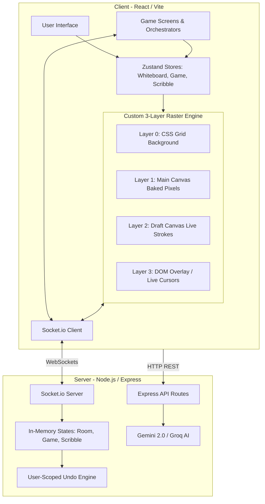

# Drawwww

A modern, ultra-low latency collaborative drawing application built with React, Socket.io, and a custom **High-Performance HTML5 Raster Engine**.

🌍 **Live Demo:** [https://aettheriia.vercel.app/](https://aettheriia.vercel.app/)

## 🏗️ Architecture Diagram


```mermaid
graph TD
    subgraph Frontend [Client - React / Vite]
        UI[User Interface]
        Zustand[Zustand Stores: Whiteboard, Game, Scribble]
        subgraph Engine [Custom 3-Layer Raster Engine]
            L0[Layer 0: CSS Grid Background]
            L1[Layer 1: Main Canvas Baked Pixels]
            L2[Layer 2: Draft Canvas Live Strokes]
            L3[Layer 3: DOM Overlay / Live Cursors]
        end
        GameScreens[Game Screens & Orchestrators]
        UI --> Zustand
        GameScreens --> Zustand
        Zustand --> Engine
        SocketClient[Socket.io Client]
        Engine <--> SocketClient
        GameScreens <--> SocketClient
    end

    subgraph Backend [Server - Node.js / Express]
        SocketServer[Socket.io Server]
        RoomState[In-Memory States: Room, Game, Scribble]
        UndoEngine[User-Scoped Undo Engine]
        API[Express API Routes]
        ExternalAI[Gemini 2.0 / Groq AI]
        
        SocketServer --> RoomState
        RoomState --> UndoEngine
        API --> ExternalAI
    end

    SocketClient <-->|WebSockets| SocketServer
    Frontend -->|HTTP REST| API
```

## 🚀 Features

- **Real-time Collaboration**: Instantly see what others are drawing via optimized command-log syncing.
- **Advanced 3-Layer Raster Engine**: 
    - Replaced traditional heavy vector libraries with a custom raw Canvas 2D engine for iPad-like drawing performance.
    - Features `perfect-freehand` for silky smooth, pressure-simulated strokes.
- **Advanced Tools**:
    - **Pencil Variants**: Sketch, Marker, Spray, and **Highlighter** (using `multiply` compositing).
    - **Flood Fill**: Intelligent canvas region filling.
    - **True Pixel Eraser**: A destructive `destination-out` eraser that perfectly cuts through raster pixels in real-time.
    - **Fluid Shapes**: Rectangle, Circle, Triangle, Diamond, Star, Hexagon, Arrow (baked instantly to raster).
- **Background Images**: Upload coloring pages or image outlines to draw over. Automatically enforces image file type filtering (`.png`, `.jpg`, `.webp`, etc.).
- **Live Multiplayer Cursors**: See where everyone is hovering in real-time, complete with their nicknames.
- **User-Scoped Undo/Redo**: Server-managed, fully robust undo/redo system. Undoing your action *only* removes your strokes, without interfering with the drawings of other collaborators.
- **Image Export**: Download your high-res canvas directly to a PNG with a single click.
- **Hybrid Object Overlay (Text)**: 
    - Instagram-style floating text annotations! Text floats in a DOM layer above the canvas.
    - Drag to move, type to auto-resize, and pull the handle to scale natively without interfering with raster artwork.
- **Smart Viewport**:
    - A fixed 1920x1080 canvas that automatically scales to perfectly fit any device screen. Smart paddings allow the UI toolbars to fit seamlessly on mobile devices.
- **Ephemeral Rooms & Avatars**: Frictionless entry—just pick an avatar, enter a nickname, and join a room. All drawings reside purely in memory on the server for ultra-low latency and privacy, automatically clearing when empty.
- **Host Moderation**: 
    - The first user in a room becomes the Host.
    - Features include kicking disruptive users and toggling layer locks to prevent drawing.

---

### 🎮 "Draw This Shytt" Game Mode
A turn-based drawing party game powered by vision-centric AI!
- **AI Scoring Judge**: Powered by **Gemini 2.0 Flash Vision**, the AI scores your drawing (0-100) based on accuracy and resemblance to the target word.
- **AI Word Generation**: Powered by **Groq (Llama 3.3 70B)** to generate creative, random, drawable words on the fly (or use the 160+ predefined categories).
- **Isolated Canvas Phase**: Players draw on their own private canvas while the "Picker" gets a live spectator dashboard to watch everyone's progress simultaneously.
- **Score Reveals & Leaderboard**: Animated side-by-side reveals of everyone's drawings alongside their AI-assigned scores and an ongoing leaderboard.
- **High-Frequency Spectator Updates**: Drawing snapshots are synchronized every **300ms** (reduced from 800ms) for a silky-smooth spectator stream.
- **Active Scoring Synchronization**: Instead of a blind sleep, the turn engine dynamically polls submission states (up to a 20s timeout) to transition to the reveal screen immediately when all drawings are scored.
- **Empty Canvas Detection**: Detects and submits blank canvases as `'empty'`, bypassing Gemini API calls to conserve API credits and instantly scoring 0 points.
- **API Error Resilience**: A standardized catch block handles Gemini API rate limiting (429) or failures by logging the error and providing a fallback randomized score (**40-80 points**) to keep the party flowing.

---

### ✏️ "Scribble" Game Mode
A classic real-time word guessing game running alongside the AI-judged mode!
- **Turn-based Drawing Loop**: One player is selected as the drawer (using a server-managed fair rotation algorithm) while all other players guess the word in real-time.
- **Real-time Chat & Guessing System**: A dedicated guess box handles inputs. Correct guesses are hidden from other guessers and announced as `"[User] guessed the word!"` with inline chat avatars.
- **"Almost!" Proximity System**: Intelligent distance matching using the Levenshtein distance algorithm triggers private `"Almost! 🔥"` feedback for guesses off-by-one or off-by-two, while alerting the drawer that the user is close.
- **Collapsible Drawer Chat Panel**: The drawer gets a space-saving, collapsible sidebar panel to see guesses, system alerts ("X is close..."), and correct answers with user avatars.
- **Authoritative Hint Engine**: Server-side countdown reveals a random unrevealed letter index every 20 seconds.
- **Order & Speed-Based Scoring**: Combines speed (up to 100 points calculated from the time ratio) with guess order (50/40/30/25/20/15 bonuses) for up to 150 points. Drawer receives 10 points per correct guesser.
- **Late-Joiner Synchronization**: Full canvas synchronization for late joiners by replaying the complete historical command log of canvas strokes.
- **Chat Avatars**: Custom player avatars are displayed inline next to guesses and announcements.

## 🛠️ Setup & Installation

### Option 1: Docker (Recommended)

```bash
# Clone the repo and start all services
docker compose up --build

# App available at:
#   Frontend → http://localhost
#   Backend API → http://localhost:3000
```

To stop:
```bash
docker compose down          # Stop containers
```

---

### Option 2: Manual Setup

#### Prerequisites
- Node.js (v18+ recommended)
- npm

#### 1. Backend Setup

```bash
cd Backend
npm install
npm run dev
# Server starts on http://localhost:3000
```

#### 2. Frontend Setup

```bash
cd Frontend
npm install
npm run dev
# App starts on http://localhost:5173
```

## 🎮 How to Use

1.  Open the application in your browser.
2.  **Customize your Avatar and Enter a Nickname** to join.
3.  **Create or Join a Room** from the lobby.
4.  **Start Drawing!**
    - Click **Pencil** to choose between Sketch, Marker, Highlighter, or Spray.
    - Click **Fill** to fill regions with color.
    - Click **Shapes** to drag-and-drop geometric forms.
    - Use the **Eraser** to slice through raster ink.
    - Upload an image to use as a background.
    - Use **Undo/Redo** buttons or `Ctrl+Z` / `Ctrl+Y`.
    - Click **Download** to save your masterpiece as a PNG.
5.  Share the Room ID with a friend to collaborate in real-time.
6.  Or click **Draw This Shytt 🎮** or **Scribble ✏️** from the lobby to start a drawing competition!

## 🏗️ Project Structure

```
├── docker-compose.yml          # Full stack orchestration
├── Backend/
│   ├── index.ts                # Express entry point
│   ├── routes/
│   │   └── gameRoutes.ts       # AI scoring endpoints & empty-canvas handler
│   ├── game/
│   │   ├── timer.ts            # Authoritative shared timer module
│   │   ├── wordLists.ts        # Shared drawing word libraries
│   │   ├── gameState.ts        # Draw This Shytt state logic
│   │   └── scribbleState.ts    # Scribble state engine & Levenshtein
│   └── socket/
│       ├── handlers.ts         # Whiteboard socket events
│       ├── gameHandlers.ts     # Draw This Shytt handlers & active scoring wait
│       └── scribbleHandlers.ts # Scribble multiplayer room loop
└── Frontend/
    └── src/
        ├── App.tsx             # Main app (Lobby, Avatars, Route management)
        ├── store.ts            # Zustand global whiteboard state
        ├── engine/             # Custom HTML5 Canvas Engine
        │   ├── RasterBrush.ts  # Brush physics & compositing logic
        │   ├── RasterShapes.ts # Geometry rendering
        │   └── floodFill.ts    # Web Worker capable flood fill
        ├── game/               # Draw This Shytt UI components
        │   ├── gameStore.ts    # Zustand Game store
        │   ├── gameSocket.ts   # Game socket hooks
        │   ├── GameMode.tsx    # Game screen orchestrator
        │   ├── DrawingScreen.tsx # Screen with immediate scoring transition
        │   └── GameCanvas.tsx  # Shared game canvas
        ├── scribble/           # Scribble UI components & State
        │   ├── scribbleStore.ts  # Zustand Scribble store
        │   ├── scribbleSocket.ts # Dedicated scribble socket hook
        │   ├── ScribbleMode.tsx  # Game screen orchestrator
        │   ├── ScribbleLobby.tsx # Game settings and player lobby
        │   ├── ScribbleDrawScreen.tsx # Canvas + Collapsible Chat Panel
        │   ├── ScribbleGuessScreen.tsx # Live guesses, chat stream & avatars
        │   ├── ScribbleCountdownScreen.tsx # 3-2-1 turn start count
        │   ├── ScribbleWaitingScreen.tsx # Waiting for drawer to pick
        │   ├── ScribbleWordPicker.tsx # 3-card word selection
        │   └── ScribbleRevealScreen.tsx # Turn scores & word reveal
        └── components/
            ├── RasterWhiteboard.tsx # 3-Layer Canvas system
            ├── DraggableText.tsx    # Hybrid DOM Object Layer
            ├── LiveCursors.tsx      # Remote Multiplayer Cursors
            ├── Toolbar.tsx          # UI Controls
            ├── AvatarEditor.tsx     # Custom Avatar Builder
            └── ColorPicker.tsx      # Palette Selection
```

## 🔧 Configuration

### Environment Variables

Create a `.env` file in the root of the project:

```env
# Server Config
PORT=3000

# Frontend Config
VITE_API_URL=http://localhost:3000
CLIENT_URL=http://localhost:3001

# Game Mode — AI Scoring (Required for Draw This Shytt)
# Get a free key: https://aistudio.google.com/apikey
GEMINI_API_KEY=your_gemini_key_here

# Game Mode — AI Word Generation (Optional, used for both modes)
# Get a free key: https://console.groq.com/keys
GROQ_API_KEY=your_groq_key_here
```