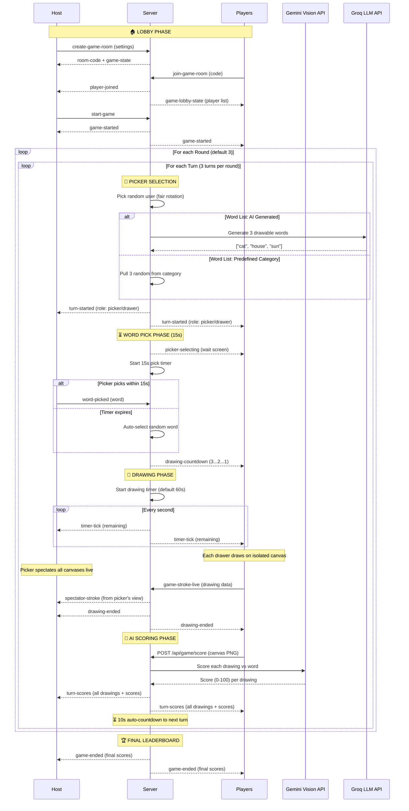
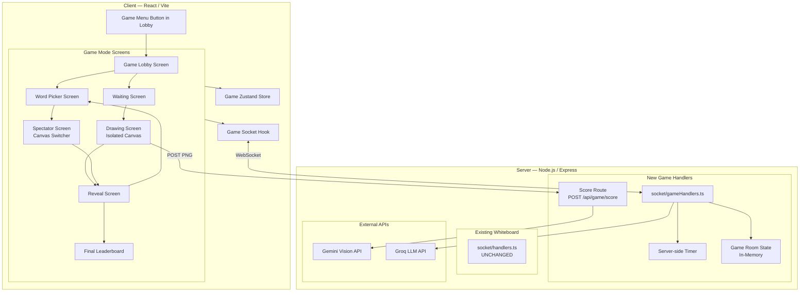

# 🎮 "Draw This Shytt" — Game Architecture

## Full Game Flow Diagram



## System Architecture



## File Structure (New Files Only)

```
Backend/
├── socket/
│   ├── handlers.ts              # UNCHANGED
│   └── gameHandlers.ts          # NEW — all game socket events
├── routes/
│   └── gameRoutes.ts            # NEW — /api/game/score endpoint
├── game/
│   ├── gameState.ts             # NEW — game room state management
│   ├── wordLists.ts             # NEW — predefined word categories
│   └── timer.ts                 # NEW — server-side timer
└── index.ts                     # MODIFIED — register game handlers + routes

Frontend/src/
├── game/
│   ├── gameStore.ts             # NEW — Zustand store for game state
│   ├── gameSocket.ts            # NEW — game socket hook
│   ├── GameLobby.tsx            # NEW — lobby with settings
│   ├── WordPicker.tsx           # NEW — 3-card word selection
│   ├── WaitingScreen.tsx        # NEW — "picker is choosing"
│   ├── DrawingScreen.tsx        # NEW — isolated canvas + timer
│   ├── SpectatorScreen.tsx      # NEW — picker's canvas switcher
│   ├── RevealScreen.tsx         # NEW — scores + drawings reveal
│   ├── FinalLeaderboard.tsx     # NEW — end-of-game leaderboard
│   └── GameCanvas.tsx           # NEW — reusable isolated canvas
├── App.tsx                      # MODIFIED — add game route
└── store.ts                     # UNCHANGED
```

## Socket Events (Game-Specific)

| Event | Direction | Payload |
|-------|-----------|---------|
| `create-game-room` | Client → Server | `{ settings, nickname, avatar }` |
| `join-game-room` | Client → Server | `{ roomCode, nickname, avatar }` |
| `game-lobby-state` | Server → Client | `{ players[], settings, hostId, roomCode }` |
| `start-game` | Client → Server | `{ roomCode }` |
| `game-started` | Server → Client | `{ totalRounds, turnsPerRound }` |
| `turn-started` | Server → Client | `{ round, turn, pickerId, role, words? }` |
| `word-picked` | Client → Server | `{ roomCode, word }` |
| `picker-selecting` | Server → Client | `{ pickerId, pickerName }` |
| `drawing-countdown` | Server → Client | `{ count: 3/2/1 }` |
| `timer-tick` | Server → Client | `{ remaining: number }` |
| `drawing-ended` | Server → Client | `{}` |
| `game-stroke-live` | Client → Server | `{ roomCode, strokeData }` |
| `spectator-stroke` | Server → Client | `{ fromUser, strokeData }` |
| `canvas-snapshot` | Client → Server | `{ roomCode, pngBase64 }` |
| `turn-scores` | Server → Client | `{ scores[], drawings[] }` |
| `next-turn-countdown` | Server → Client | `{ remaining: number }` |
| `game-ended` | Server → Client | `{ finalScores[], winner }` |
| `player-left-game` | Server → Client | `{ playerId }` |

## Scoring Rules

- Points per turn = Gemini score (0–100)
- Picker gets 0 points for their turn
- Cumulative across all rounds
- Stored in server memory (ephemeral, no DB)
