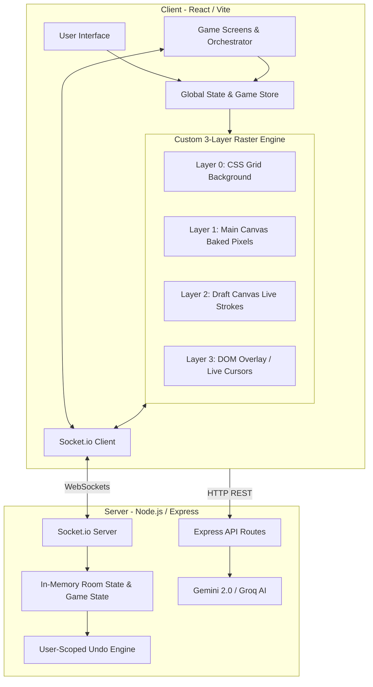

# Project Report: Drawwww

## 1. Introduction

**Drawwww** is a modern, ultra-low latency collaborative drawing application and multiplayer drawing game. It enables users to draw, sketch, and annotate together in real time on a shared digital canvas, or compete in an AI-judged drawing party game called "Draw This Shytt". The project emphasizes high-performance graphics, a smart user interface, and robust functionality, including pressure-simulated pencil styles, fluid geometric shapes, Instagram-style floating text annotations, real-time multiplayer cursors, and AI-powered image analysis.

🌍 **Live Demo:** [https://aettheriia.vercel.app/](https://aettheriia.vercel.app/)

## 2. Architecture Overview

The application follows a **Client-Server Architecture** augmented with **WebSockets** for real-time data synchronization.

- **Frontend (Client)**: A Single Page Application (SPA) built with React. It handles the UI, manages an advanced **3-Layer Custom HTML5 Raster Engine**, controls the flow of the built-in game mode, and communicates real-time drawing events and cursor coordinates.
- **Backend (Server)**: A Node.js/Express service that provides RESTful endpoints for AI scoring and AI word generation, and manages real-time Socket.io connections. It synchronizes a compact "command log" of drawing strokes, manages room host privileges, and orchestrates turn-based game logic.
- **Database (Optional/Future)**: The backend architecture abstracts state management using memory maps (`rooms = new Map()`) for ultra-low latency, ephemeral sessions that perfectly synchronize concurrent users, with paths ready for persistent database storage integration via MongoDB.
- **Infrastructure**: Containerized using Docker, orchestrated via Docker Compose. The frontend is served using an Nginx reverse proxy.

## 3. Tech Stack

### Frontend
- **Framework**: React 19 (with TypeScript)
- **Build Tool**: Vite
- **Styling**: Tailwind CSS v4
- **State Management**: Zustand
- **Graphics Engine**: Custom HTML5 Canvas 2D Engine (3-Layer Architecture)
- **Stroke Physics**: `perfect-freehand` (for pressure simulation and smoothing)
- **Real-time Communication**: `socket.io-client`
- **Icons**: Lucide React

### Backend
- **Runtime**: Node.js
- **Framework**: Express.js (v5.x)
- **Language**: TypeScript
- **Real-time Engine**: Socket.io
- **AI Integration**: Google Gemini 2.0 Flash Vision API (Scoring), Groq Llama 3 (Word Generation)
- **Session Management**: Ephemeral memory maps for room state and game logic

### Deployment & Infrastructure
- **Containerization**: Docker, Docker Compose
- **Web Server**: Nginx (Frontend static file serving and routing)

## 4. Key Components

### 4.1 Frontend Components

- **`RasterWhiteboard.tsx`**: The core component of the application. It implements a sophisticated 3-layer system: a CSS-driven Grid Layer (Layer 0), a Persistent Baked Canvas (Layer 1), a Transient Live-Preview Canvas (Layer 2), and a Hybrid DOM Object Overlay (Layer 4) for text and live multiplayer cursors. It translates user pointer events into optimized drawing commands and acts as the primary interface for Socket.io.
- **`Toolbar.tsx`**: The user interface for selecting drawing tools. It supports nested sub-menus for tool variants (e.g., Pencil, Marker, Highlighter, Spray, Neon), shape selections, flood fill, and strictly-filtered image outline uploading (`accept="image/png, image/jpeg..."`).
- **`LiveCursors.tsx`**: An overlay component that independently subscribes to socket cursor coordinate broadcasts to render fellow collaborators' mouse movements smoothly without triggering expensive heavy canvas re-renders.
- **`AvatarEditor.tsx` & `AvatarPreview.tsx`**: A custom sprite-layering engine that lets users build unique avatars (Eyes, Mouth, Base Color) for visual identification in the lobby and via live cursors inside rooms.
- **`engine/RasterBrush.ts` & `floodFill.ts`**: The physics and pixel-manipulation core. `RasterBrush` utilizes `perfect-freehand` to translate pointer points into beautiful SVG-like raster paths. `floodFill` utilizes a high-performance stack-based BFS pixel replacement algorithm on `ImageData`.
- **`store.ts` & `gameStore.ts`**: The Zustand global state stores. They manage application-wide states such as the current selected tool, active texts, room context, user avatar settings, and the complex state machine for the turn-based game mode.
- **Game Mode Screens**: Components like `GameMode.tsx`, `GameLobby.tsx`, `DrawingScreen.tsx`, and `SpectatorScreen.tsx` orchestrate the "Draw This Shytt" game loop, handling countdowns, isolated canvases, and animated score reveals.

### 4.2 Backend Components

- **`index.ts`**: The main entry point for the Express server. It configures middleware, sets up the Socket.io server, manages CORS policies, and registers routes (including the `/api/game` routes for AI integration).
- **`socket/handlers.ts` & `socket/gameHandlers.ts`**: The core real-time logic. They listen to events like `join-room`, `draw-event`, and `cursor-move`, broadcasting them with near-zero latency. `gameHandlers.ts` securely manages the turn-based state machine, timers, and score tracking for the game mode.
- **User-Scoped Undo Engine**: Integrated directly into `handlers.ts`. Every stroke is tagged with the user's `authorId`. When a user requests an `undo`, the server filters out only *their* last action, and triggers an `undo-replay` broadcast to the entire room to mathematically reconstruct the canvas correctly for everyone.
- **AI Scoring (`gameRoutes.ts`)**: Secure backend REST API endpoints that package PNG exports and send them alongside strict deterministic prompts to the **Gemini 2.0 Flash Vision** model for parsing 0-100 scores. Also interfaces with **Groq** for generating creative drawing words.

## 5. Features and Capabilities

1. **Real-Time Collaboration**: Using Socket.io, active strokes (`stroke-live`), completed lines (`draw-event`), and mouse movements (`cursor-move`) are broadcasted instantly to all connected clients in a room.
2. **High-Performance Custom Raster Engine**:
   - Built directly on the native HTML5 Canvas API, stripping away heavy vector libraries like Fabric.js to achieve pure 60fps drawing performance.
   - A clever Smart Viewport system wraps a fixed 1920x1080 canvas in CSS transforms, ensuring the drawing area flawlessly scales to fit any laptop or mobile monitor without pixel distortion.
3. **Advanced Drawing Tools**:
   - **Pressure-Sensitive Brushes**: Smooth, dynamic strokes using `perfect-freehand` with variants like Sketch, Marker, Spray, and Neon.
   - **Highlighter Engine**: Employs `multiply` global composite operations, allowing translucent marker strokes to stack and organically darken underlying artwork without obscuring it.
   - **Fluid Geometric Shapes**: Intuitive MS Paint-style shape drawing that instantly bakes into the raster canvas.
   - **Algorithmic Flood Fill**: Fast BFS boundary-filling utilizing direct `Uint32Array` manipulation on raw pixel data.
4. **True Eraser Engine**: The eraser acts as a true destructive mask. It uses `destination-out` compositing to permanently slice through and remove painted pixels, exactly like an eraser in Photoshop or an iPad drawing app.
5. **Robust Server-Side Undo/Redo**: Solves the complex issue of collaborative undo logic. Traditional local snapshot undo mechanisms would mistakenly erase concurrent collaborator strokes. Drawwww utilizes a central server command log to gracefully unroll *only* the requesting user's strokes, maintaining absolute state fidelity across clients.
6. **"Draw This Shytt" AI Game Mode**: 
   - A fully built-in, real-time multiplayer drawing competition.
   - Utilizes isolated Canvas 2D instances for each player while a designated "Picker" watches everyone's progress live on a unified dashboard.
   - Features autonomous AI judging via the Google Gemini Vision API, which visually inspects each player's canvas export and assigns a highly accurate 0-100 score based on resemblance to the target word.
7. **Host Controls & Moderation**: Integrated privilege system that grants room creators the ability to lock canvases to read-only or kick disruptive participants.

## 6. Conclusion

Drawwww is a feature-rich, scalable real-time drawing tool. By developing a deeply optimized custom Raster Engine paired with a modern React interface and intelligent server-side synchronization, it achieves iPad-level drawing fluidity and true pixel manipulation in the browser. The Node.js/Socket.io backend ensures a seamless, multi-user collaborative experience with zero-friction onboarding, making it immediately ready for scale.
