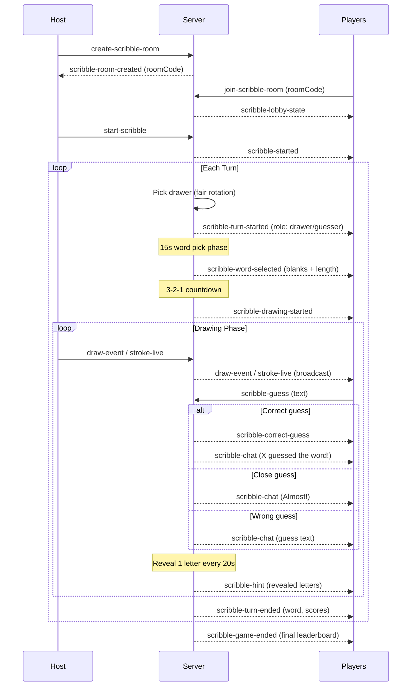

# Scribble Game Mode — Architecture

## Game Flow Diagram



## Scoring System

| Guess Order | Points |
|-------------|--------|
| 1st correct | 100 |
| 2nd correct | 85 |
| 3rd correct | 70 |
| 4th correct | 60 |
| 5th correct | 50 |
| 6th+ correct | 40 (minimum) |
| Wrong guess | 0 |
| Drawer | 10 × number of correct guessers |

## Component Map

```
Backend/
├── socket/scribbleHandlers.ts    # Socket event handlers
├── game/scribbleState.ts         # Room state + guess validation
├── game/timer.ts                 # Reused from Draw This Shytt
└── game/wordLists.ts             # Reused from Draw This Shytt

Frontend/src/scribble/
├── ScribbleMode.tsx              # Main orchestrator
├── ScribbleLobby.tsx             # Create/Join (reuses GameLobby style)
├── ScribbleDrawScreen.tsx        # Drawer's canvas + timer
├── ScribbleGuessScreen.tsx       # Guesser's live view + chat + guess input
├── ScribbleRevealScreen.tsx      # Turn scores + word reveal
├── ScribbleFinalLeaderboard.tsx  # Reuses FinalLeaderboard component
├── scribbleSocket.ts             # Socket hook
└── scribbleStore.ts              # Zustand store
```

## Key Differences from "Draw This Shytt"

| Feature | Draw This Shytt | Scribble |
|---------|-----------------|----------|
| Who draws | Everyone except picker | Only the drawer |
| Scoring | AI (Gemini Vision) | Speed-based guess order |
| Canvas sync | Snapshots to spectator | Full stroke broadcast |
| Guess system | None | Real-time chat |
| API dependency | Gemini + Groq | Groq only (optional) |
| Hint system | None | Letter reveal every 20s |
